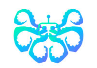

<div align="center">
  
  <h1>Polvo</h1>
  <p>Desktop editor rethought for working with AI agents.<br>Write specs. Run agents. Ship faster.</p>

  [](LICENSE)
  [](https://github.com/co2-lab/polvo/releases)
  [](https://go.dev)
  [](https://github.com/co2-lab/polvo/releases)
</div>

<br>

<div align="center">
  
</div>

---

## What is Polvo?

Polvo is a **spec-first desktop editor** built for AI-augmented development. Instead of jumping straight to code, you define what you want to build in a spec file — then specialized AI agents generate, verify, and refine the implementation.

It runs as a local desktop app (via Tauri) with an embedded Go server and a React UI. No cloud, no subscriptions — your API keys, your machine.

---

## Features

<table>
  <tr>
    <td align="center" width="33%">
      <b>📋 Spec-First</b><br>
      <sub>Write specs in markdown. Agents turn them into code, tests, and docs.</sub>
    </td>
    <td align="center" width="33%">
      <b>🤖 Specialized Agents</b><br>
      <sub>Each agent has its own guide and context. No one-size-fits-all prompts.</sub>
    </td>
    <td align="center" width="33%">
      <b>⚡ Built-in Terminal</b><br>
      <sub>Full PTY terminal inside the editor. Run commands without leaving the app.</sub>
    </td>
  </tr>
  <tr>
    <td align="center" width="33%">
      <b>🗂️ Multi-workspace</b><br>
      <sub>Open multiple projects side by side in a flexible panel layout.</sub>
    </td>
    <td align="center" width="33%">
      <b>🔌 Multi-provider</b><br>
      <sub>Claude, OpenAI, Gemini, Ollama — switch models per agent or project.</sub>
    </td>
    <td align="center" width="33%">
      <b>🔒 Local-first</b><br>
      <sub>Runs entirely on your machine. Data never leaves without your keys.</sub>
    </td>
  </tr>
</table>

---

## Installation

### macOS
```bash
brew install --cask co2-lab/tap/polvo
```

### Windows
```powershell
winget install co2-lab.Polvo
```

### Linux
Download the `.AppImage` or `.deb` from [releases](https://github.com/co2-lab/polvo/releases).

### Manual
Download the latest installer for your platform from [releases](https://github.com/co2-lab/polvo/releases/latest).

---

## Quick Start

1. Open Polvo and create or open a project folder
2. Create a spec file — e.g. `src/auth/login.spec.md`
3. Describe what you want to build in plain language
4. Run an agent from the sidebar
5. Review the output in the editor

---

## Configuration

Place a `polvo.yaml` in your project root:

```yaml
project:
  name: "my-project"

providers:
  default:
    type: claude
    api_key: "${ANTHROPIC_API_KEY}"
    default_model: "claude-sonnet-4-6"
  local:
    type: ollama
    base_url: "http://localhost:11434"
    default_model: "codellama:13b"

interfaces:
  patterns:
    - "src/**/*.tsx"
    - "api/handlers/**/*.go"
  derived:
    spec:     "{{dir}}/{{name}}.spec.md"
    features: "{{dir}}/{{name}}.feature"
    tests:    "{{dir}}/{{name}}.test.{{ext}}"
```

API keys are always referenced via environment variables — never hardcoded.

<details>
<summary><b>Supported providers</b></summary>

| Provider | Type | Required env var |
|---|---|---|
| Ollama | `ollama` | — (local, default `http://localhost:11434`) |
| Claude | `claude` | `ANTHROPIC_API_KEY` |
| OpenAI | `openai` | `OPENAI_API_KEY` |
| Gemini | `gemini` | `GEMINI_API_KEY` |
| OpenAI-compatible | `openai-compatible` | `API_KEY` |

</details>

<details>
<summary><b>Environment variables</b></summary>

| Variable | Default | Description |
|---|---|---|
| `POLVO_ROOT` | `cwd` | Project root directory (set automatically by Tauri) |
| `POLVO_IDE_PORT` | `7373` | HTTP server port |
| `SHELL` | `/bin/sh` | Shell used for the integrated terminal (Unix) |
| `COMSPEC` | `cmd.exe` | Shell used for the integrated terminal (Windows) |

</details>

---

## Architecture

```
polvo/
  app/       # Go backend — HTTP server, agent orchestration, file system API
  ui/        # React frontend — editor, terminal, panels (Vite + TypeScript)
  desktop/   # Tauri wrapper — native window, sidecar process management
```

The Go binary embeds the compiled UI and serves it at `http://localhost:7373`. Tauri wraps it as a native desktop app with a sidecar process.

---

## Development

<details>
<summary><b>Prerequisites</b></summary>

- Go 1.25+
- Node.js 20+
- Rust + Cargo (for Tauri desktop builds)

</details>

```bash
# Desktop app (Tauri + hot reload)
make dev

# Web only (no Tauri)
make web-dev

# Backend only
make app-dev

# Run tests
make test

# Production build
make build
```

---

## Contributing

Contributions are welcome! Please read [CONTRIBUTING.md](CONTRIBUTING.md) before opening a PR.

---

## License

Polvo is licensed under the [Elastic License 2.0](LICENSE) — free to use, modify, and self-host. Commercial redistribution requires a separate agreement.

---

<div align="center">
  <sub>Built with ❤️ by <a href="https://github.com/co2-lab">co2-lab</a></sub>
</div>
